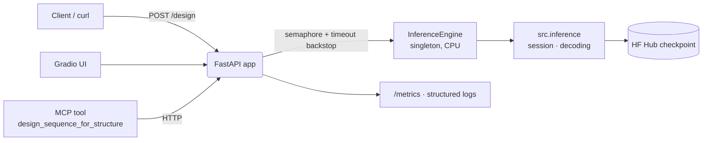

# UMA-Inverse

[](https://github.com/WSobo/UMA-Inverse/actions/workflows/ci.yml)
[](https://www.python.org/)
[](https://arxiv.org/abs/2607.07866)
[](LICENSE)
[](https://huggingface.co/spaces/WSobo/uma-inverse)
[](https://modelcontextprotocol.io)
[](https://claude.com/claude-code)

**Ligand-conditioned protein inverse folding via dense pair-wise attention.**

Given a fixed protein–ligand backbone, UMA-Inverse predicts per-residue amino-acid identity (20 AA + X) under optional design constraints. The architecture is a single dense PairMixer encoder over the union of residue and ligand-atom nodes — no KNN sparsification — giving every residue a direct edge to every ligand atom, with an auxiliary distogram objective and a learned ligand-attention decoder. It is compact (~3.3 M parameters) and built on the LigandMPNN data protocol (parser, train/valid/test splits); for a controlled comparison we re-run LigandMPNN under our identical protocol rather than relying on published numbers.

→ Preprint: [UMA-Inverse: Ligand-Conditioned Protein Inverse Folding with a Distogram-Supervised Dense Pair Encoder](https://doi.org/10.48550/arXiv.2607.07866)

---

## Install

Requires Python 3.13. [uv](https://github.com/astral-sh/uv) is recommended (fast, lockfile-reproducible):

```bash
git clone https://github.com/WSobo/UMA-Inverse.git
cd UMA-Inverse
uv sync                        # installs the package + deps from uv.lock
```

If you don't have uv, plain pip works too: `pip install -e .` (uses the same `pyproject.toml`, no lockfile guarantee).

Trained weights live on [Hugging Face](https://huggingface.co/WSobo/UMA-Inverse) and are **auto-fetched on first inference** into `~/.cache/uma-inverse/`. No separate setup step is required. To pre-fetch explicitly (e.g. for offline machines), run `uv run python scripts/download_weights.py`.

The model is compact (~3.3 M parameters): inference runs comfortably on **CPU** — the live Space designs a 46-residue protein in ~50 ms — or on any GPU. A GPU is only needed for training.

---

## Quickstart

Design 10 sequences for a PDB at `T = 0.1` with random decoding order (matches the LigandMPNN inference protocol):

```bash
uv run uma-inverse design \
    --pdb my_complex.pdb \
    --num-samples 10 \
    --temperature 0.1 \
    --seed 42
```

The first call downloads the default checkpoint (~27 MB) and caches it; subsequent calls reuse it. Pass `--ckpt path/to/your.ckpt` to override.

Outputs are written under `outputs/<pdb-stem>-<timestamp>/`:

```
outputs/my_complex-2026-05-06T14-30-00/
├── my_complex.fa          # FASTA with native + 10 designs
├── ranked.csv             # per-design recovery, log-likelihood, dedup'd & ranked
└── run.log                # parameters used + per-PDB timing
```

---

## Serving & Deployment

Beyond the CLI, UMA-Inverse ships a **containerized, monitored REST service** that
serves the trained model on CPU and exposes it to both humans (Gradio UI) and AI
agents (MCP tool). It is deploy-ready for **Hugging Face Spaces CPU Basic** (free tier).

- **Live Space:** <https://huggingface.co/spaces/WSobo/uma-inverse>
  (app: <https://wsobo-uma-inverse.hf.space>).
- **Observed CPU latency** (HF Spaces CPU Basic, 2 vCPU): **~50 ms** to design a
  **46-residue** protein (1CRN); model load ~1.1 s. Autoregressive decoding is one
  decoder pass per residue, so latency scales ~linearly with length — a ~140-residue
  structure takes seconds. The live endpoint caps inputs at ~600 residues
  (`UMA_MAX_RESIDUES`) — a **memory** guard (dense O(N²) pairwise model on the
  free 16 GB box), not a speed limit; raise it on hardware with more RAM.



### REST contract

`POST /design`

```json
{ "pdb": "<full PDB text>", "ligand": null, "temperature": 0.1, "n_samples": 1 }
```

Returns `sequences`, `per_residue_confidence`, `mean_confidence`, `n_residues`,
`inference_ms`, `request_id`. Response headers: `X-Request-ID`, `X-Inference-MS`.
Structures over `UMA_MAX_RESIDUES` (~600 on the live Space) → `413`; bad body → `422`;
timeout backstop → `504`. Other endpoints: `GET /health`, `GET /metrics`
(Prometheus), `GET /docs` (OpenAPI), `GET /` (Gradio UI).

`POST /score`

```json
{ "pdb": "<full PDB text>", "sequence": null, "mode": "autoregressive" }
```

Scores a sequence against the structure (native by default). Returns per-residue
`log_prob`/`prob`, the model's preferred residue (`top_aa`/`top_prob`), overall
`perplexity` (lower = better fit), and `recovery` — so an agent can flag suboptimal
residues and propose mutations. `mode` is `autoregressive` (fast; `num_batches`
forward passes) or `single-aa` (per-residue; slower).

### Observability

Real metrics from real requests via `prometheus-client` at `/metrics`:
`uma_inference_latency_seconds` (histogram → p50/p90/p99), `uma_request_size_residues`,
`uma_mean_confidence`, `uma_requests_total`, `uma_inflight_requests`,
`uma_model_load_seconds`. Every request emits a JSON log line (request_id,
endpoint, input size, latency, mean confidence, status) via `structlog`. The
Gradio "Live metrics" tab renders these.

### Confidence / uncertainty

Surfaced from the model's own output, not recalibrated: **per-residue** confidence
is the softmax max-probability at each position; the **aggregate** is the existing
LigandMPNN-style `overall_confidence = exp(mean log p of sampled residues)`.

### Agent (MCP) usage

```bash
UMA_API_URL=https://<user>-uma-inverse.hf.space uv run python -m src.mcp.server
```

Exposes two tools, each returning markdown:
- `design_sequence_for_structure(pdb, ligand?, temperature?)` — redesign a backbone.
- `score_structure(pdb, sequence?, mode?)` — score a sequence and return a
  **candidate-mutation** table (residues the model would change).

The intended story: an agent retrieves a structure (e.g. via genesis-bio-mcp),
**scores** it to find suboptimal residues, then **redesigns** it — all against this
deployed model.

Run the service locally:

```bash
uv sync --extra serving
make serve   # auto-fetches the v5 checkpoint from HF on first run, then serves :7860
# equivalently (same thing):
uv run uvicorn src.serving.app:app --host 0.0.0.0 --port 7860
# pin a local/alternate checkpoint with UMA_CKPT=path/to.ckpt
# or build the CPU image:
docker build -t uma-inverse-serving . && docker run -p 7860:7860 uma-inverse-serving
```

The `deploy/hf_space/` directory holds the Hugging Face Spaces deployment files.

---

## Inference reference

UMA-Inverse exposes two subcommands: `design` (sample sequences) and `score` (compute per-residue log-likelihoods under the trained model).

### `uma-inverse design`

**Sampling controls:**

| Flag | Default | Notes |
|---|---|---|
| `--num-samples` | 1 | Number of sequences to sample per PDB. |
| `--temperature` | 0.1 | Sampling temperature. `0.0` = argmax. |
| `--top-p` | (off) | Nucleus threshold in `(0, 1]`. |
| `--seed` | random | Base seed; sample `i` uses `seed + i`. |
| `--decoding-order` | `random` | `random` (matches LigandMPNN) or `left-to-right`. |
| `--batch-size` | 1 | Samples decoded in parallel per forward pass. GPU-memory dial. |

**Constraint flags** (all optional, all stackable):

| Flag | Format | Effect |
|---|---|---|
| `--fix` | `"A1 A2 B42C"` or `"A1,A2"` | Hold these residues at native. |
| `--redesign` | same | Redesign only these (complement is held native). |
| `--design-chains` | `"A,B"` | Redesign only these chains. |
| `--parse-chains` | `"A,B"` | Only parse these chains into the structure. |
| `--bias` | `"W:3.0,A:-1.0"` | Global per-AA logit bias. |
| `--bias-file` | JSON path | Per-residue bias: `{"A23": {"W": 3.0}, ...}`. |
| `--omit` | `"CDFG"` or `"C,D,F,G"` | Globally forbid these AAs. |
| `--omit-file` | JSON path | Per-residue omit: `{"A23": "CDFG", ...}`. |
| `--tie` | `"A1,A10\|B5,B15"` | Tie residue groups (groups separated by `\|`). |
| `--tie-weights` | matched to `--tie` | Per-position weights within tie groups. |

**Pocket-fixed redesign** (the use case characterized in the preprint):

```bash
uv run uma-inverse design \
    --pdb my_complex.pdb \
    --fix "A12 A14 A56 A89 A124" \
    --num-samples 20 --temperature 0.1
```

**Batch mode** (many PDBs, with crash recovery):

```bash
# spec.json: {"path/to/a.pdb": {}, "path/to/b.pdb": {"fix": "A1 A2"}, ...}
uv run uma-inverse design \
    --pdb-list spec.json \
    --out-dir outputs/screen \
    --num-samples 5 \
    --resume    # skip PDBs already recorded in .done.txt
```

### `uma-inverse score`

Compute autoregressive log-likelihoods of the native (or a user-supplied) sequence at every position:

```bash
# Score the native sequence (averaged over 10 random decoding orders)
uv run uma-inverse score \
    --pdb my_complex.pdb \
    --mode autoregressive \
    --num-batches 10

# Score a custom sequence
uv run uma-inverse score \
    --pdb my_complex.pdb \
    --sequence "MKVL...QED"

# Single-AA scoring (each position scored with all others held native)
uv run uma-inverse score --pdb my_complex.pdb --mode single-aa
```

Writes `scores_<pdb>.csv` (per-position log-likelihoods) and `scores_<pdb>.json` (summary).

### Other useful flags

- `--mask-ligand` — zero ligand-atom features (ablation, no ligand context).
- `--ligand-cutoff` — Å cutoff for ligand-proximal scoring (default 8.0).
- `--max-total-nodes` — cap residues+ligand atoms (overrides config; useful for OOM-tight GPUs).
- `--save-probs` — also dump the full `[N, L, 21]` probability tensor as `.npz`.
- `--write-ranked` / `--no-ranked` — write (or suppress) the dedup'd `ranked.csv` output.
- `--include-native` / `--no-native` — include (or suppress) the native sequence as the first FASTA record.
- `--device {cuda,cpu,auto}` — defaults to auto.
- `-v` / `-vv` — INFO / DEBUG logging.

For the full option list: `uv run uma-inverse design --help` or `--score --help`.

---

## Architecture & benchmarks

UMA-Inverse replaces LigandMPNN's sparse KNN graph with a **dense pair-representation encoder**: six
**PairMixer** blocks (triangle multiplication outgoing/incoming + transition MLP — no triangle
self-attention, no sequence/MSA track) refine every residue–residue and residue–ligand-atom pair in a
single `[L+M, L+M]` tensor built from RBF-encoded inter-atom distances. An auxiliary **distogram**
objective keeps that pair tensor structure-predictive, and the autoregressive decoder reads ligand
context through a learned, position-specific attention over the pair tensor (rather than a uniform
mean pool). The model is compact (**~3.3 M parameters**). Decoding is autoregressive over a
randomized residue order at `T = 0.1`, matching the LigandMPNN inference protocol.

**Interface sequence recovery** on the LigandMPNN test splits (10 samples/PDB, `T = 0.1`, 5 Å
sidechain–nonprotein cutoff, mean-of-per-PDB-medians). LigandMPNN is **re-run under this identical
protocol** (its published value in parentheses); ProteinMPNN (published, no ligand conditioning) is a
lower bound:

| Split | N | UMA-Inverse | LigandMPNN (ours / paper) | ProteinMPNN |
|---|--:|--:|--:|--:|
| Small molecule | 317 | **0.561** | 0.598 (0.633) | 0.505 |
| Metal | 82 | **0.551** | 0.644 (0.775) | 0.406 |
| Nucleotide | 74 | **0.353** | 0.533 (0.505) | 0.340 |

UMA-Inverse trails LigandMPNN on every split (by 3.7 / 9.3 / 18.0 pp), but the gap is markedly
smaller under the controlled re-run than the published numbers imply (e.g. metal: 0.644 vs. the
published 0.775). On teacher-forced recovery over the full validation set it reaches **66.1 %**
per-PDB mean recovery (perplexity 2.57, ECE 0.008).

Its distinctive property is **representational**: the dense all-pairs encoder propagates ligand
identity to residues far beyond the interface, where LigandMPNN's KNN signal decays. In a
**pocket-fixed** redesign setting the designs remain confidently folded and ligand-binding-competent
under Boltz-2 cofolding (again modestly behind LigandMPNN). We offer it as a compact, honest, MSA-free
baseline for ligand-conditioned inverse folding — see the preprint for the full characterization.

---

## Development

For training, data prep, and reproducing benchmark numbers, see [`scripts/paper/`](scripts/paper/)
(reproduce the preprint experiments) and the SLURM wrappers under [`scripts/SLURM/`](scripts/SLURM/).

```bash
# Reproduce training (SLURM HPC; v5 stage 3 ran on 2× A100, ~1 week)
make download        # fetch PDBs from RCSB
make preprocess      # cache .pt tensors
make pilot           # 1-batch overfit sanity check
make train-v5        # chained 3-stage v5 curriculum (64 → 128 → 384 nodes)
```

```bash
make test          # CPU-only pytest suite
make lint          # ruff
```

---

## Paper

**UMA-Inverse: Ligand-Conditioned Protein Inverse Folding with a Distogram-Supervised Dense Pair Encoder**
William Sobolewski. arXiv:2607.07866 [q-bio.BM], 2026.
[[abs](https://arxiv.org/abs/2607.07866)] · [[pdf](https://arxiv.org/pdf/2607.07866)]

UMA-Inverse does not outperform LigandMPNN on interface recovery or cofolded ligand pose.
Its contribution is a compact alternative architecture and a characterization of how a dense
all-pairs encoder propagates ligand signal to residues far beyond the binding interface.

## Citation

```bibtex
@misc{sobolewski2026umainverse,
  title         = {UMA-Inverse: Ligand-Conditioned Protein Inverse Folding
                   with a Distogram-Supervised Dense Pair Encoder},
  author        = {Sobolewski, William},
  year          = {2026},
  eprint        = {2607.07866},
  archivePrefix = {arXiv},
  primaryClass  = {q-bio.BM},
  doi           = {10.48550/arXiv.2607.07866}
}
```

License: see [LICENSE](LICENSE).
